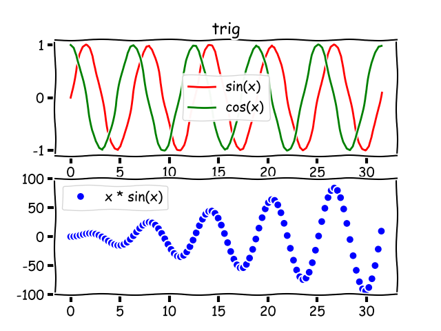
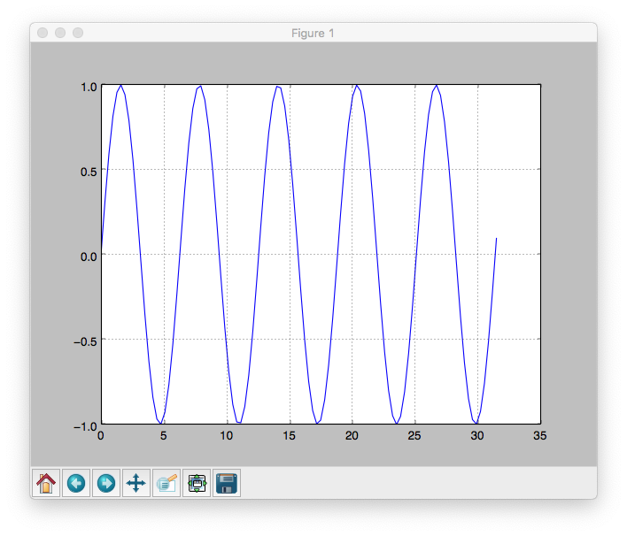

# matplotnode

C++ bindings for Node.js exposing a subset of [matplotlib](http://matplotlib.org/)'s functionality through the [CPython API](https://docs.python.org/2/extending/embedding.html). Inspired by [matplotlib-cpp](https://github.com/lava/matplotlib-cpp) by [lava](https://github.com/lava). Useful for scientific plotting.

### Requirements

* Python 2.7 (might work on Python 3, not tested yet)
* [matplotlib](http://matplotlib.org/)

### Usage

```bash
$ npm install matplotnode
```

```javascript
const plt = require('matplotnode');
```

### Bindings

- [x] `plot([x], y, ...kwargs)`*
- [x] `subplot(str)`
- [x] `show()`
- [x] `legend()`
- [x] `grid(bool active)`
- [x] `save(filename)`
- [x] `xlim(from, to)`
- [x] `ylim(from, to)`
- [x] `title(name)`
- [x] `axis(axis)`
- [x] `xlabel(name)`
- [x] `ylabel(name)`
- [x] `clf()`
- [x] `cla()`
- [x] `close()`

**See how `kwargs` are implemented in `test.js`*

### Example

```javascript
const plt = require('matplotlib');
const x = new Array(100).fill(0).map((x, i) => i / Math.PI);

plt.subplot('211');
plt.plot(x, x.map(Math.sin), 'color=r', 'label=sin(x)');
plt.plot(x, x.map(Math.cos), 'color=g', 'label=cos(x)');
plt.legend();

plt.subplot('212');
plt.plot(x, x.map(Math.tan), 'color=b', 'label=tan(x)', 'marker=o', 'linestyle=None');
plt.legend();
plt.grid(true);
plt.ylim(-5, 5);

plt.save('./examples/subplot.png');
```




```javascript
const plt = require('matplotlib');
const x = new Array(100).fill(0).map((x, i) => i / Math.PI);

plt.plot(x, x.map(Math.sin));
plt.grid(true);
plt.show();
```


